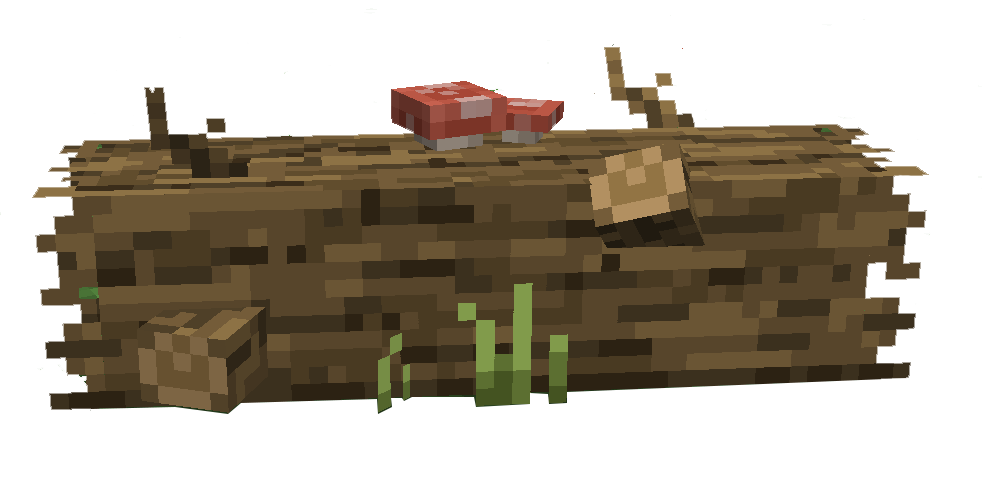
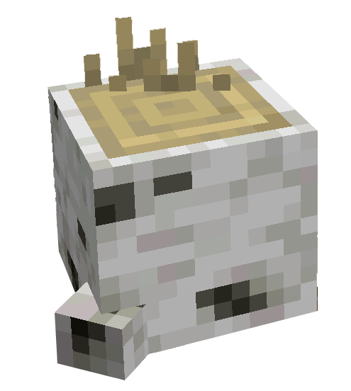

# Bucheron


Il existe dans le Palier 1 deux type de Bois à récolter :

* 🌳 <mark style="color:green;">Chêne</mark>
* 🌳 Bouleau


Les Buches se divise en deux catégories :\
&#xNAN;_&#x45;xemple avec le Chêne_




<figure><figcaption></figcaption></figure>




Souche de Bois\
Donne 1 Buche à la récolte






<figure><figcaption></figcaption></figure>




Buche de Bois\
Donne 2 Buches à la récolte



<h2 align="center">Chêne</h2>


Les Buches de Chêne sont récupérable au niveau 1 de Bucheron




<figure><figcaption></figcaption></figure>



Les Buches de Chêne sont récupérable dans la Forêt (2448,4306) à l'Est en sortant de la [Ville de Départ](../carte/regions/ville-de-depart.md), accompagné du [Bucheron](../carte/personnages/bucherons.md#ville-de-depart), ou bien le long de la Forêt (2878,3571) à l'Ouest de[ Mizunari](../carte/regions/mizunari.md). Vous trouverez des buches le long du chemin principal.



***

<h2 align="center">Bouleau</h2>


Les Buches de Bouleau sont récupérable au niveau 2 de Bucheron




<figure><figcaption></figcaption></figure>



Les Buches de Bouleau sont récupérable dans la Forêt (1766,1183) au Nord de [Virelune](../carte/regions/virelune.md).&#x20;


