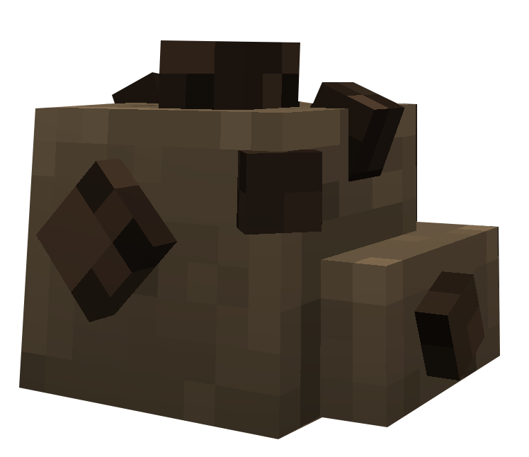
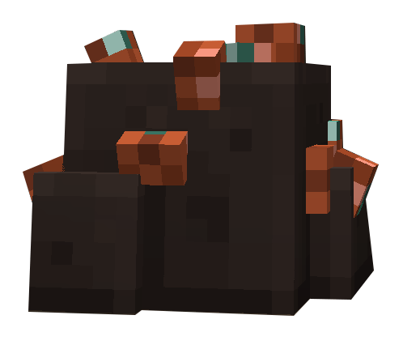
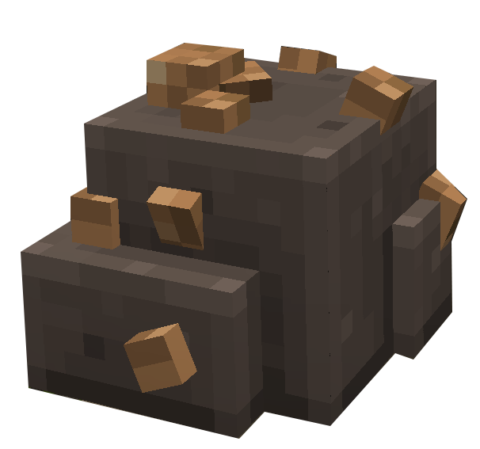

# Mineur

Niveau 1 : 1025 expérience

Cuivre / Charbon /Fer : (2399;3492) OU (982;3469)


Il existe dans le Palier 1 trois types de minerais à récolter :

* ⚫ Charbon
* 🧱 <mark style="color:orange;">Cuivre</mark>
* 🪨  <mark style="color:$info;">Fer</mark>


<h2 align="center">Charbon</h2>


Le Charbon est récupérable au niveau 1 de Mineur




<figure><figcaption></figcaption></figure>



Les Minerais de Charbon sont récupérable dans la Mine (2401,3487) au Sud du [Quartier OG](../carte/regions/quartier-og.md). Seulement dans la salle principale se trouvera environ 10 minerais.\
Une autre Mine plus grande existe (982,3474) à l'Ouest de [Hanaka](../carte/regions/hanaka.md) et du [Cyclorium](../carte/regions/cyclorim.md), avec environ 45 minerais.



***

<h2 align="center">Cuivre</h2>


Le Cuivre est récupérable au niveau 1 de Mineur




<figure><figcaption></figcaption></figure>



Les Minerais de Cuivre sont récupérable dans la Mine (2401,3487) au Sud du [Quartier OG](../carte/regions/quartier-og.md). Le long du chemin vous trouvez environ 15 minerais avant d'apparaitre dans la salle principale. Après celà environ 10 minerais seront présent dans la salle principale.\
Une autre Mine plus grande existe (982,3474) à l'Ouest de [Hanaka](../carte/regions/hanaka.md) et du [Cyclorium](../carte/regions/cyclorim.md), avec environ 45 minerais.



***

<h2 align="center">Fer</h2>


Le Fer est récupérable au niveau 2 de Mineur




<figure><figcaption></figcaption></figure>



Les Minerais de Fer sont récupérable dans la Mine (2401,3487) au Sud du [Quartier OG](../carte/regions/quartier-og.md). Seulement dans la salle principale se trouvera environ 5 minerais.\
Une autre Mine plus grande existe (982,3474) à l'Ouest de [Hanaka](../carte/regions/hanaka.md) et du [Cyclorium](../carte/regions/cyclorim.md), avec environ 15 minerais.


